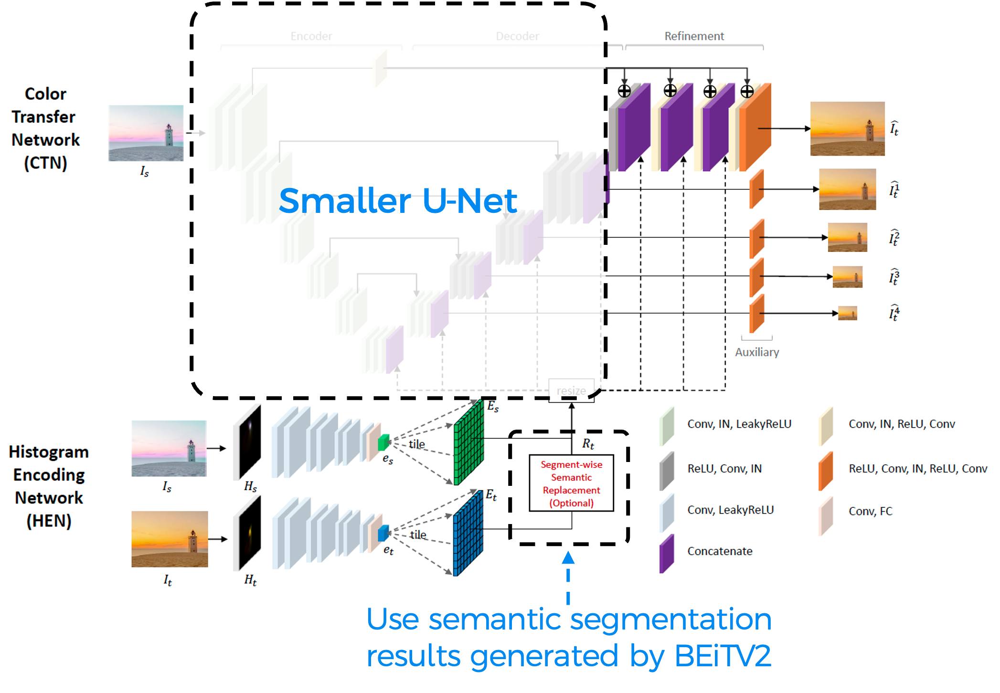



## Introduction

In this project, we are trying to build a deep-learning model for color transfer between images. Unlike style transfer which will modify objects in the image, color transfer focuses on transferring the color characteristics from the reference image to the input image while keeping the objects unchanged.

## Background

Early color transfer approaches change colors of a source image based on the global color distribution of a reference image. Some methods perform color transfer by matching the means and standard deviations of source to reference images. The authors of ***Deep Color Transfer Using Histogram Analogy***[[1]]() proposed a deep learning framework that leverages color histogram analogy for color transfer.

## Methodology

### Dataset Construction

As the authors did in [[1]](), we’ll train our model on a paired dataset constructed from the MIT-Adobe 5K dataset[[2]]() which consists of six sets, each of which contains 5,000 images. Since using the dataset only provides image pairs with a fixed number of combinations, we also follow the authors to perform color augmentation by transforming the average hue and saturation of the original images to produce more diverse image pairs. In addition, as an ideally trained model must produce the output image the same as the source image if the histograms of the two images are the same, we used identical source and reference image pairs to stabilize the network output.

### Model Structure

We kept the basic idea of the Histogram Encoding Network(HEN) and Color Transfer Network(CTN). In the HEN part, we applied the new SOTA segmentation method BEiT v2[[3]]() to generate the semantic segmentation of both reference and source images, providing more precise segmentation labels. In the CTN part, we refined the encoder network to a succinct one and leveraged knowledge distillation on training which significantly reduced the number of parameters and increased the maximum supported resolution.

### Model Training

 We implemented our network on Pytorch and used the Adam optimizer with a fixed learning rate of \\(5*10^{-5}\\) with \\(\beta_1=0.5\\), and \\(\beta_2=0.999\\). As we jointly train HEN and CTN, the objective function is:
 
\\(L_{total} = L_{image} + \lambda_1 L_{hist} + \lambda_2 L_{multi}\\)

where \\(L_{image}\\), \\(L_{hist}\\) and \\(L_{multi}\\) are an image loss, a histogram loss, and a multi-scale loss. We used \\(\lambda_1=1.5\\) and \\(\lambda_2=0.5\\).

To help the model converge faster and get better performance, we used knowledge distillation to train our new model. We used the pre-trained original model as the teacher and treat the new model as a student. The loss of the student model is combined with soft loss, which is the distance between the output from the student and the teacher, and hard loss, which is the original loss.

## Results

Experiments showed that our model can produce decent results under different circumstances. Even if the input image and reference image are irrelevant, it can generate some pretty good images. The model works well even when the reference image is abstract.

When the reference image and input image have similar semantic content, the model can generate a great color transfer without being fed with segmentation maps. However, when there's a huge content difference, segmentation maps can help improve the model performance (fig 3).

---

##### [1] Lee, Junyong, et al. "Deep color transfer using histogram analogy." The Visual Computer 36.10 (2020): 2129-2143. {#ref1}

##### [2] Bychkovsky, Vladimir, et al. "Learning photographic global tonal adjustment with a database of input/output image pairs." CVPR 2011. IEEE, 2011. {#ref2}

##### [3] Peng, Zhiliang, et al. "Beit v2: Masked image modeling with vector-quantized visual tokenizers." arXiv preprint arXiv:2208.06366 (2022). {#ref3}